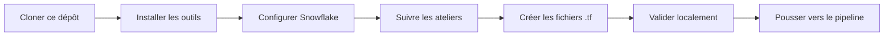

# data-platform-starter

Squelette de gouvernance pour un projet Data Platform as Code avec Terraform, Snowflake et Azure DevOps.

## Objectif

Ce dépôt est le **point d'entrée unique** de l'apprenant. Il contient :

- les **scripts d'installation et de configuration** pour préparer le poste;
- la **structure de gouvernance** (dossiers, qualité, CI/CD, docs);
- les **scripts de validation** locale.

L'apprenant clone ce dépôt au Jour 0, installe les outils, configure sa connexion Snowflake, puis crée ses fichiers `.tf` au fil des modules. **Aucun fichier `.tf` de ressource n'est fourni** : l'apprenant les crée lui-même.

## Workflow de l'apprenant



## Contenu

```text
.
├── README.md                  # Ce fichier
├── .gitignore                 # Exclut state, plans, secrets, tfvars, .terraform/
├── .gitattributes             # Normalise les fins de ligne
├── .editorconfig              # Convention d'édition
├── .tflint.hcl                # Configuration du linter
├── azure-pipelines.yml        # Pipeline CI/CD Azure DevOps
├── CODEOWNERS                 # Propriété du code et revue obligatoire
├── docs/
│   ├── architecture.md        # Architecture cible
│   ├── naming-conventions.md  # Convention de nommage
│   ├── runbook.md             # Procédures opérationnelles
│   └── adr/                   # Architecture Decision Records
│       └── 0001-record-architecture-decisions.md
├── environments/
│   ├── dev/                   # Racine Terraform DEV
│   ├── uat/                   # Racine Terraform UAT
│   └── prod/                  # Racine Terraform PROD
├── modules/
│   └── README.md              # Modules réutilisables (à créer par l'apprenant)
└── scripts/
    ├── Install-Tools.ps1           # Installation Windows
    ├── install-tools.sh            # Installation Linux/macOS
    ├── New-SnowflakeConnection.ps1 # Connexion Snowflake Windows
    ├── new-snowflake-connection.sh # Connexion Snowflake Linux/macOS
    ├── validate.ps1                # Validation locale Windows
    └── validate.sh                 # Validation locale Linux/macOS
```

## Démarrage rapide (Jour 0)

### 1. Cloner

```bash
git clone <TEMPLATE_REPO_URL> ~/Data2AI-Labs/data-platform
cd ~/Data2AI-Labs/data-platform
```

### 2. Installer les outils

**Windows :**

```powershell
powershell -ExecutionPolicy Bypass -File .\scripts\Install-Tools.ps1 -Check
powershell -ExecutionPolicy Bypass -File .\scripts\Install-Tools.ps1
```

**Linux/macOS :**

```bash
chmod +x scripts/install-tools.sh
./scripts/install-tools.sh --check
./scripts/install-tools.sh
```

### 3. Configurer `.env`

Le formateur a pré-rempli `.env.example` avec les paramètres d'accès Snowflake, Azure et Azure DevOps.

```bash
cp .env.example .env
```

Ouvrez `.env` et ajoutez uniquement :

- `LEARNER_PREFIX` : votre préfixe apprenant (fourni par le formateur);
- `SNOWFLAKE_PAT` : votre PAT temporaire (fourni par le formateur).

Les autres valeurs sont déjà remplies par le formateur. `.env` est gitignored.

### 4. Configurer la connexion Snowflake

**Windows :**

```powershell
powershell -ExecutionPolicy Bypass -File .\scripts\New-SnowflakeConnection.ps1
```

**Linux/macOS :**

```bash
./scripts/new-snowflake-connection.sh
```

Le script lit `.env` automatiquement et crée la connexion `training`.

### 5. Valider

```bash
snow sql -q 'SELECT 1' -c training
```

### 6. Suivre les ateliers

Chaque atelier du parcours indique quels fichiers créer et où. Le dépôt cloné est la **racine de travail** pour tous les fichiers `.tf`, modules et configurations.

## Ce qui n'est PAS inclus

- aucun fichier `versions.tf`, `provider.tf`, `main.tf`, `variables.tf` ou `outputs.tf`;
- aucun module Terraform de ressource;
- aucun fichier `.terraform.lock.hcl`;
- aucun state, plan ou secret.

L'apprenant crée ces fichiers au fil du parcours, en suivant les ateliers.

## Convention de nommage

Toutes les ressources suivent :

```text
<PREFIXE_APPRENANT>_<ZONE>_<ENVIRONNEMENT>
```

Exemple : `ABC_RAW_DEV`, `ABC_ETL_UAT`, `ABC_CURATED_PROD`.

Détail dans [docs/naming-conventions.md](docs/naming-conventions.md).

## Versions

Les versions de Terraform et des providers sont définies dans le document de politique de versions du parcours de formation. Aucun fichier `.tf` n'est fourni ici; l'apprenant les crée avec les contraintes exactes indiquées par le formateur.

## Sécurité

- aucun secret, mot de passe, PAT ou clé privée n'est commité;
- les fichiers `.tfvars`, `backend.hcl`, `.env` et `secrets/` sont ignorés par Git;
- le state Terraform est stocké à distance dans Azure Blob Storage;
- les clés privées des identités techniques sont stockées dans Azure Key Vault.

## Pipeline CI/CD

Le fichier `azure-pipelines.yml` définit les étapes de validation, formatage, lint, plan, approbation, apply et audit de dérive. Il est identique à celui étudié dans le module CI/CD du parcours.
