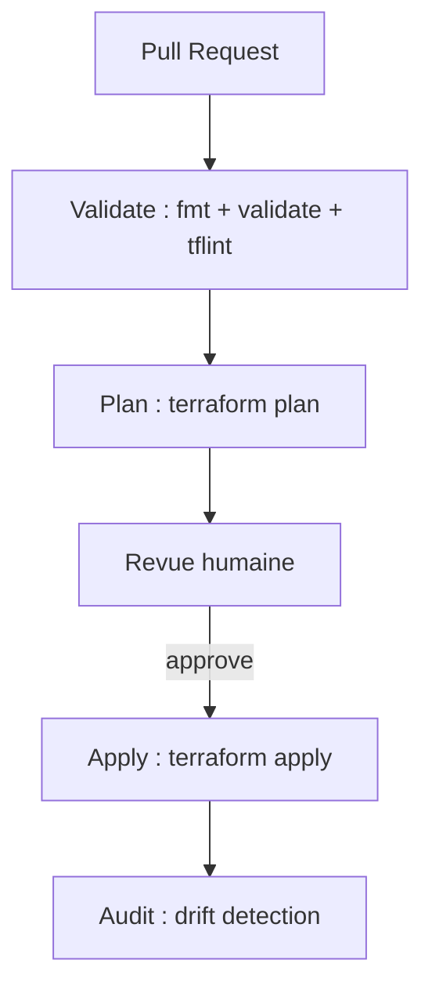

# Lab Terraform Snowflake — Pipeline CI/CD Terraform avec Azure DevOps

> **Durée estimée :** 75 minutes  
> **Public :** débutant total (aucun prérequis en CI/CD)  
> **Coût :** aucun si vous utilisez l’agent hébergé gratuit `ubuntu-latest` d’Azure DevOps  
> **Ressources créées :** aucune à détruire en fin de lab si vous ne fusionnez pas en production

---

## 0. Avant de commencer — ce que vous devez avoir

Ce lab suppose que vous êtes dans le dossier racine du présent dépôt :

```powershell
D:\Data2AI Academy\terraform-snowflake
```

### 0.1 Prérequis techniques

| Prérequis | Pourquoi ? |
|---|---|
| Terraform 1.14.5 installé | La version exacte est exigée dans `versions.tf` |
| Un compte Snowflake actif | Terraform va créer des rôles, warehouses, bases et tables |
| Un projet Azure DevOps avec un repository Git | C’est là que le pipeline s’exécute |
| Un Azure Storage account pour l’état Terraform | Déjà configuré dans `backend.tf` |
| Un PAT (Personal Access Token) Snowflake | Utilisé par Terraform pour se connecter à Snowflake |

### 0.2 Choses à vérifier avant de démarrer

Ouvrez un terminal PowerShell et tapez :

```powershell
terraform -version
```

Vous devez voir une ligne du type :

```text
Terraform v1.14.5
on windows_amd64
```

> Si vous avez une autre version, ce lab peut échouer. Installez la version 1.14.5.

Ensuite, placez-vous dans le dossier du lab :

```powershell
cd "D:\Data2AI Academy\terraform-snowflake"
```

Vérifiez que les fichiers sont bien là :

```powershell
Get-ChildItem
```

Vous devez voir au minimum :

```text
backend.tf
main.tf
outputs.tf
provider.tf
terraform.tfvars
variables.tf
versions.tf
azure-pipelines.yml
modules/
```

---

## 1. Mission métier et user story

Les changements manuels dans Snowflake posent deux problèmes :

1. **Personne ne sait qui a fait quoi et quand.**
2. **Une erreur humaine peut détruire des objets en production sans filet.**

Nous allons donc automatiser le déploiement de l’infrastructure Snowflake avec un pipeline CI/CD Azure DevOps.

> **En tant que :** Data Platform Engineer  
> **Je veux :** configurer un pipeline CI/CD Azure DevOps pour Terraform  
> **Afin de :** garantir la séparation des responsabilités et l’approbation avant déploiement

---

## 2. Architecture mentale du lab

### 2.1 Nouvelle structure du dépôt

Avant, ce module faisait partie d’un grand dépôt `data-platform` avec des sous-dossiers `labs/m06-dynamic-logic/`, `labs/m07-cicd-pipeline/`, etc.  
Maintenant, le dépôt est **autonome** (flat structure) :

```text
terraform-snowflake/
├── backend.tf              # Où Terraform stocke son état (Azure Storage)
├── main.tf                 # Assemblage des modules
├── variables.tf            # Variables attendues par le projet
├── terraform.tfvars        # Valeurs concrètes des variables
├── provider.tf             # Connexion à Snowflake
├── versions.tf             # Versions de Terraform et du provider
├── outputs.tf              # Ce que Terraform affiche à la fin
├── azure-pipelines.yml     # Le pipeline CI/CD
└── modules/
    ├── rbac/               # Rôles Snowflake
    ├── compute/            # Warehouses Snowflake
    ├── landing-zone/       # Base, schéma et tables RAW
    ├── data-domain/        # Base, schéma et tables métier
    └── data-mart/          # Base, schéma et tables de reporting
```

> **Important pour les débutants :** Terraform lit tous les fichiers `.tf` du dossier courant comme s’ils n’en formaient qu’un seul. Vous n’avez pas besoin de tout comprendre en détail, mais il faut savoir où chaque morceau vit.

### 2.2 Flux du pipeline



| Étape | Rôle | Qui la déclenche ? |
|---|---|---|
| `Validate` | Vérifie le format, la syntaxe et les bonnes pratiques | Chaque push sur une PR |
| `Plan` | Affiche ce que Terraform va créer / modifier / détruire | Chaque push sur une PR |
| `Approval` | Un humain doit approuver avant apply | Uniquement sur `main` |
| `Apply` | Applique réellement les changements sur Snowflake | Uniquement sur `main` après approbation |
| `Audit` | Vérifie qu’il n’y a plus de dérive entre la config et la réalité | Après apply sur `main` |

---

## 3. Objectifs pédagogiques vérifiables

À la fin de ce lab, vous saurez :

- [ ] Créer et lire un fichier `azure-pipelines.yml`.
- [ ] Configurer un *Variable Group* dans Azure DevOps.
- [ ] Lier le pipeline à un repository Azure DevOps.
- [ ] Exécuter un `terraform plan` automatiquement sur une Pull Request.
- [ ] Approuver manuellement un déploiement avant `terraform apply`.
- [ ] Comprendre à quoi sert une *environment gate*.

---

## 4. Diagnostic pre-flight

### 4.1 Vérifier que le projet Terraform est valide en local

Avant de brancher Azure DevOps, testons que Terraform peut lire le projet.

Ouvrez PowerShell, placez-vous dans `D:\Data2AI Academy\terraform-snowflake`, puis tapez :

```powershell
terraform init -backend=false
```

> `-backend=false` signifie : "vérifie la syntaxe et les modules, mais ne te connecte pas encore au stockage Azure de l’état."

Attendez la fin. Vous devez voir :

```text
Terraform has been successfully initialized!
```

Puis tapez :

```powershell
terraform validate
```

Résultat attendu :

```text
Success! The configuration is valid.
```

> Si vous obtenez une erreur, ne continuez pas. Relisez les messages et vérifiez que vous êtes bien à la racine du dépôt.

### 4.2 Utiliser le script `setup.ps1` (recommandé pour les débutants)

Un script d’aide `setup.ps1` est fourni à la racine. Il vérifie Terraform, crée le dossier `secrets/`, demande votre PAT Snowflake, et lance `terraform init -backend=false` + `terraform validate`.

Dans PowerShell, tapez :

```powershell
.\setup.ps1
```

Suivez les instructions à l’écran. Si tout est vert, votre poste est prêt.

> Le script est une aide, pas une obligation. Vous pouvez aussi suivre les étapes manuelles ci-dessous.

### 4.3 Vérifier le backend Terraform (état distant)

Ouvrez le fichier `backend.tf`. Vous devez y voir quelque chose comme :

```hcl
terraform {
  backend "azurerm" {
    resource_group_name  = "rg-data2ai-tf-state"
    storage_account_name = "sadata2aitfstatemsn"
    container_name       = "tfstate"
    key                  = "dev/terraform.tfstate"
    use_azuread_auth     = true
  }
}
```

Ce fichier dit à Terraform où stocker son état.  
Avant de continuer, assurez-vous que :

1. Le `storage_account_name` et le `container_name` existent bien dans votre tenant Azure.
2. La clé `key` correspond à votre environnement. Par défaut elle vaut `dev/terraform.tfstate`. Si vous êtes plusieurs apprenants sur le même Storage Account, chacun doit utiliser une clé différente (par exemple `dev/APP01/terraform.tfstate`).
3. Vous êtes authentifié auprès d’Azure. Pour vérifier, tapez dans PowerShell :

```powershell
az account show
```

Si vous n’êtes pas connecté, exécutez :

```powershell
az login
```

> **Pourquoi ?** `use_azuread_auth = true` signifie que Terraform utilise votre identité Azure pour écrire l’état dans le Storage Account.

---

## 5. Étapes d’implémentation pas à pas

### Étape 5.1 — Préparer le fichier de secrets local

Terraform a besoin d’un token pour se connecter à Snowflake.  
Nous ne mettrons **jamais** ce token dans le code. Nous le stockons dans un fichier local non versionné.

#### 5.1.1 Créer le dossier `secrets`

Dans PowerShell, tapez :

```powershell
New-Item -ItemType Directory -Path "D:\Data2AI Academy\terraform-snowflake\secrets" -Force
```

#### 5.1.2 Créer le fichier `snowflake_pat.txt`

Toujours dans PowerShell :

```powershell
New-Item -ItemType File -Path "D:\Data2AI Academy\terraform-snowflake\secrets\snowflake_pat.txt" -Force
```

#### 5.1.3 Écrire votre PAT Snowflake dans le fichier

1. Ouvrez le fichier `secrets\snowflake_pat.txt` avec un éditeur de texte (Notepad, VS Code, etc.).
2. Collez votre PAT Snowflake seul sur la première ligne.
3. Enregistrez et fermez.

> Ne mettez **aucun espace**, **aucun retour à la ligne supplémentaire** et **aucun guillemet** autour du token.

#### 5.1.4 Vérifier que le fichier n’est pas versionné

Le fichier `secrets/snowflake_pat.txt` ne doit jamais partir sur Git. Par précaution, nous ajoutons un fichier `.gitignore`.

Créez un fichier `.gitignore` à la racine du dépôt avec ce contenu :

```text
# Secrets
secrets/
*.tfstate
*.tfstate.*
.terraform/
.terraform.lock.hcl
```

Si le fichier `.gitignore` existe déjà, ajoutez simplement `secrets/` à la fin.

---

### Étape 5.2 — Tester un `terraform plan` en local (optionnel mais recommandé)

Cette étape prouve que votre configuration est correcte avant de passer à Azure DevOps.

#### 5.2.1 Configurer les variables d’environnement Azure

Le `backend.tf` utilise un Azure Storage account. Pour que `terraform init` fonctionne, Terraform a besoin de savoir dans quel tenant et quelle souscription Azure il travaille.

Dans PowerShell, tapez (remplacez les valeurs par les vôtres) :

```powershell
$env:ARM_SUBSCRIPTION_ID = "12345678-1234-1234-1234-123456789012"
$env:ARM_TENANT_ID = "12345678-1234-1234-1234-123456789012"
```

> Ces valeurs se trouvent dans le portail Azure : **Azure Active Directory > Properties > Tenant ID** et **Subscriptions > votre souscription > Subscription ID**.

Si vous êtes déjà connecté avec Azure CLI, vous pouvez aussi utiliser :

```powershell
$env:ARM_SUBSCRIPTION_ID = (az account show --query id -o tsv)
$env:ARM_TENANT_ID = (az account show --query tenantId -o tsv)
```

#### 5.2.2 Lancer `terraform plan`

```powershell
cd "D:\Data2AI Academy\terraform-snowflake"
terraform init
terraform plan -input=false
```

> **Attention :** cette commande va se connecter au backend Azure et à Snowflake. Elle ne crée rien, elle affiche seulement ce qui serait créé.

Vous devez voir un plan avec des objets Snowflake. Par exemple :

```text
Plan: 6 to add, 0 to change, 0 to destroy.
```

Si le plan s’affiche sans erreur, votre configuration locale est prête.

Si vous voyez l’erreur suivante, c’est normal : votre PAT n’est pas encore renseigné ou est invalide.

```text
Error: open snowflake connection: 394400 (08004): Programmatic access token is invalid.
```

Dans ce cas :

1. Vérifiez que le fichier `secrets/snowflake_pat.txt` existe.
2. Vérifiez que le token est correct et qu’il n’y a pas d’espace ou de retour à la ligne.
3. Relancez `terraform plan -input=false`.

---

### Étape 5.3 — Créer le pipeline Azure DevOps

Le fichier `azure-pipelines.yml` est déjà présent à la racine du dépôt.  
Ouvrez-le et lisez-le. Voici ce qu’il fait, étape par étape.

#### 5.3.1 Contenu du fichier `azure-pipelines.yml`

```yaml
# Azure DevOps pipeline for Terraform CI/CD
# This pipeline validates, plans, applies and audits Terraform changes.
# It is placed at the repository root because this is a self-contained lab.

trigger:
  branches:
    include:
      - main

pr:
  branches:
    include:
      - main

pool:
  vmImage: 'ubuntu-latest'

variables:
  - group: data-platform-secrets
  - name: TF_VERSION
    value: '1.14.5'

stages:
  - stage: Validate
    jobs:
      - job: Validate
        steps:
          - task: TerraformInstaller@1
            displayName: 'Install Terraform'
            inputs:
              terraformVersion: '$(TF_VERSION)'

          - script: |
              terraform fmt -check -recursive
            displayName: 'terraform fmt -check'

          - script: |
              terraform init -backend=false
              terraform validate
            displayName: 'terraform validate'
            env:
              TF_VAR_snowflake_token: $(SNOWFLAKE_PAT)
              ARM_SUBSCRIPTION_ID: $(ARM_SUBSCRIPTION_ID)
              ARM_TENANT_ID: $(ARM_TENANT_ID)
              ARM_CLIENT_ID: $(ARM_CLIENT_ID)
              ARM_CLIENT_SECRET: $(ARM_CLIENT_SECRET)

          - script: |
              TFLINT_VERSION="0.50.0"
              curl -s https://raw.githubusercontent.com/terraform-linters/tflint/master/install_linux.sh | bash
              tflint --recursive
            displayName: 'tflint'
            continueOnError: true

  - stage: Plan
    dependsOn: Validate
    jobs:
      - job: Plan
        steps:
          - task: TerraformInstaller@1
            displayName: 'Install Terraform'
            inputs:
              terraformVersion: '$(TF_VERSION)'

          - script: |
              terraform init
              terraform plan -out=tfplan -input=false
            displayName: 'Terraform Plan'
            env:
              TF_VAR_snowflake_token: $(SNOWFLAKE_PAT)
              ARM_SUBSCRIPTION_ID: $(ARM_SUBSCRIPTION_ID)
              ARM_TENANT_ID: $(ARM_TENANT_ID)
              ARM_CLIENT_ID: $(ARM_CLIENT_ID)
              ARM_CLIENT_SECRET: $(ARM_CLIENT_SECRET)

          - task: PublishPipelineArtifact@1
            displayName: 'Publish tfplan'
            inputs:
              targetPath: 'tfplan'
              artifact: tfplan

  - stage: Approval
    dependsOn: Plan
    condition: and(succeeded(), eq(variables['Build.SourceBranch'], 'refs/heads/main'))
    jobs:
      - deployment: Approval
        environment: Approval
        strategy:
          runOnce:
            deploy:
              steps:
                - script: echo "Waiting for manual approval"
                  displayName: 'Manual approval gate'

  - stage: Apply
    dependsOn: Approval
    condition: and(succeeded(), eq(variables['Build.SourceBranch'], 'refs/heads/main'))
    jobs:
      - job: Apply
        steps:
          - task: TerraformInstaller@1
            displayName: 'Install Terraform'
            inputs:
              terraformVersion: '$(TF_VERSION)'

          - task: DownloadPipelineArtifact@2
            displayName: 'Download tfplan'
            inputs:
              artifact: tfplan
              targetPath: '$(System.DefaultWorkingDirectory)'

          - script: |
              terraform init
              terraform apply tfplan -input=false
            displayName: 'Terraform Apply'
            env:
              TF_VAR_snowflake_token: $(SNOWFLAKE_PAT)
              ARM_SUBSCRIPTION_ID: $(ARM_SUBSCRIPTION_ID)
              ARM_TENANT_ID: $(ARM_TENANT_ID)
              ARM_CLIENT_ID: $(ARM_CLIENT_ID)
              ARM_CLIENT_SECRET: $(ARM_CLIENT_SECRET)

  - stage: Audit
    dependsOn: Apply
    condition: and(succeeded(), eq(variables['Build.SourceBranch'], 'refs/heads/main'))
    jobs:
      - job: Audit
        steps:
          - task: TerraformInstaller@1
            displayName: 'Install Terraform'
            inputs:
              terraformVersion: '$(TF_VERSION)'

          - script: |
              terraform init
              terraform plan -detailed-exitcode -input=false
            displayName: 'Drift detection (terraform plan -detailed-exitcode)'
            env:
              TF_VAR_snowflake_token: $(SNOWFLAKE_PAT)
              ARM_SUBSCRIPTION_ID: $(ARM_SUBSCRIPTION_ID)
              ARM_TENANT_ID: $(ARM_TENANT_ID)
              ARM_CLIENT_ID: $(ARM_CLIENT_ID)
              ARM_CLIENT_SECRET: $(ARM_CLIENT_SECRET)
```

#### 5.3.2 Que se passe-t-il dans chaque stage ?

| Stage | Déclencheur | Description détaillée |
|---|---|---|
| **Validate** | PR + `main` | Installe Terraform, vérifie le format avec `fmt`, valide la syntaxe avec `validate`, lance `tflint` pour les bonnes pratiques. |
| **Plan** | PR + `main` | Initialise le backend Azure, lance `terraform plan`, publie le plan `tfplan` comme artifact. |
| **Approval** | `main` uniquement | Pose une porte d’approbation manuelle. Le pipeline s’arrête ici jusqu’à ce qu’un humain clique sur **Approve**. |
| **Apply** | `main` uniquement | Télécharge le plan, applique les changements sur Snowflake. |
| **Audit** | `main` uniquement | Relance un `terraform plan` pour vérifier qu’il n’y a plus de dérive. |

---

### Étape 5.4 — Configurer le Variable Group dans Azure DevOps

Le pipeline lit les secrets dans un **Variable Group** nommé `data-platform-secrets`. Nous allons le créer.

#### 5.4.1 Ouvrir Azure DevOps

1. Allez sur [https://dev.azure.com](https://dev.azure.com) et connectez-vous.
2. Choisissez votre organisation et votre projet.

#### 5.4.2 Créer le Variable Group

1. Dans le menu de gauche, cliquez sur **Pipelines** > **Library**.
2. Cliquez sur **+ Variable group**.
3. Renseignez :
   - **Variable group name :** `data-platform-secrets`
   - **Description :** Secrets pour le pipeline Terraform Snowflake
4. Cliquez sur **+ Add** pour ajouter les variables suivantes :

| Nom de variable | Type | Valeur | Explication |
|---|---|---|---|
| `SNOWFLAKE_PAT` | Secret | Votre PAT Snowflake | Le token utilisé par Terraform pour se connecter. |
| `ARM_SUBSCRIPTION_ID` | Standard | ID de votre souscription Azure | Utilisé pour le backend d’état. |
| `ARM_TENANT_ID` | Standard | ID de votre tenant Azure | Utilisé pour le backend d’état. |
| `ARM_CLIENT_ID` | Standard | ID d’application (service principal) Azure | Identité du pipeline pour écrire l’état. |
| `ARM_CLIENT_SECRET` | Secret | Secret du service principal | Mot de passe de l’identité du pipeline. |

5. Cochez la case **Keep this value secret** pour `SNOWFLAKE_PAT` et `ARM_CLIENT_SECRET`.
6. Cliquez sur **Save**.

> **Sécurité :** le token Snowflake et le secret du service principal ne doivent apparaître nulle part dans le code. C’est pourquoi ils vivent dans le Variable Group.

#### 5.4.3 Créer le service principal Azure (ou récupérer un existant)

Le pipeline a besoin d’une identité Azure pour écrire l’état Terraform dans le Storage Account. Vous avez deux possibilités.

**Option A : votre formateur vous a fourni un service principal**

Demandez-lui :
- `ARM_CLIENT_ID` (Application ID)
- `ARM_CLIENT_SECRET` (secret)
- `ARM_TENANT_ID`
- `ARM_SUBSCRIPTION_ID`

Passez directement à l’étape 5.4.4.

**Option B : créer le service principal vous-même**

1. Connectez-vous à Azure CLI :

```powershell
az login
```

2. Créez le service principal et notez l’ID et le secret :

```powershell
$sp = az ad sp create-for-rbac `
  --name "terraform-snowflake-lab" `
  --role "Storage Blob Data Contributor" `
  --scopes "/subscriptions/<votre-subscription-id>/resourceGroups/rg-data2ai-tf-state/providers/Microsoft.Storage/storageAccounts/sadata2aitfstatemsn/blobServices/default/containers/tfstate" `
  --query '{appId:appId, password:password, tenant:tenant}' -o json | ConvertFrom-Json

Write-Output "ARM_CLIENT_ID: $($sp.appId)"
Write-Output "ARM_CLIENT_SECRET: $($sp.password)"
Write-Output "ARM_TENANT_ID: $($sp.tenant)"
```

> Remplacez `<votre-subscription-id>` et vérifiez le nom du resource group et du storage account dans `backend.tf`.

3. Si la commande précédente échoue avec un rôle, vous pouvez attribuer le rôle manuellement dans le portail Azure :
   - Allez sur le Storage Account > **Access Control (IAM)** > **Add role assignment**.
   - Rôle : **Storage Blob Data Contributor**.
   - Membre : le service principal créé (`terraform-snowflake-lab`).

4. Copiez les 4 valeurs (`appId`, `password`, `tenant`, `subscriptionId`) dans le Variable Group.

#### 5.4.4 Vérifier que le Variable Group est complet

Votre Variable Group `data-platform-secrets` doit maintenant contenir :

| Variable | Type | Explication |
|---|---|---|
| `SNOWFLAKE_PAT` | Secret | PAT Snowflake |
| `ARM_SUBSCRIPTION_ID` | Standard | Souscription Azure |
| `ARM_TENANT_ID` | Standard | Tenant Azure |
| `ARM_CLIENT_ID` | Standard | ID du service principal |
| `ARM_CLIENT_SECRET` | Secret | Secret du service principal |

---

### Étape 5.5 — Créer l’environnement d’approbation dans Azure DevOps

Le stage `Approval` utilise un environnement Azure DevOps nommé `Approval`. Nous devons le créer.

1. Dans le menu de gauche, allez dans **Pipelines** > **Environments**.
2. Cliquez sur **New environment**.
3. Renseignez :
   - **Name :** `Approval`
   - **Description :** Manual approval gate for Terraform apply
4. Cliquez sur **Create**.
5. Cliquez sur l’environnement `Approval` nouvellement créé.
6. Allez dans l’onglet **Approvals and checks**.
7. Cliquez sur **+** et choisissez **Approvals**.
8. Ajoutez votre utilisateur comme approbateur.
9. Laissez les autres options par défaut et cliquez sur **Create**.

---

### Étape 5.6 — Connecter le repository et créer le pipeline

1. Dans le menu de gauche, allez dans **Pipelines** > **Pipelines**.
2. Cliquez sur **New pipeline**.
3. Choisissez **Azure Repos Git** (ou le type de repository où se trouve ce code).
4. Sélectionnez votre repository `terraform-snowflake`.
5. Choisissez **Existing Azure Pipelines YAML file**.
6. Dans le sélecteur de fichier, choisissez `/azure-pipelines.yml` (à la racine).
7. Cliquez sur **Continue**.
8. Azure DevOps affiche un aperçu du YAML. Cliquez sur **Run** pour lancer le pipeline sur `main`.

> Comme il n’y a pas encore de Pull Request, le pipeline s’exécute sur `main`. Il s’arrêtera au stage `Approval`.

---

### Étape 5.7 — Créer une branche et faire un changement mineur

Nous allons simuler une vraie modification : ajouter un warehouse `REPORTING`.

#### 5.7.1 Créer une branche

Dans PowerShell, placez-vous dans le dépôt :

```powershell
cd "D:\Data2AI Academy\terraform-snowflake"
git checkout -b feature/add-reporting-warehouse
```

#### 5.7.2 Modifier `terraform.tfvars`

Ouvrez le fichier `terraform.tfvars` dans un éditeur de texte.

Trouvez le bloc `warehouses` :

```hcl
warehouses = {
  ingest = {
    suffix       = "INGEST"
    comment      = "Warehouse d'ingestion"
    auto_suspend = 60
  }
}
```

Ajoutez un nouveau warehouse `reporting` :

```hcl
warehouses = {
  ingest = {
    suffix       = "INGEST"
    comment      = "Warehouse d'ingestion"
    auto_suspend = 60
  }
  reporting = {
    suffix       = "REPORTING"
    comment      = "Warehouse de reporting"
    auto_suspend = 60
  }
}
```

> **Astuce :** chaque warehouse est identifié par une clé unique (`ingest`, `reporting`). La clé n’a pas d’importance, seul le `suffix` compte pour le nom final.

#### 5.7.3 Commit et push

Dans PowerShell :

```powershell
git add terraform.tfvars
git commit -m "feat: ajoute le warehouse REPORTING"
git push origin feature/add-reporting-warehouse
```

Si c’est la première fois que vous poussez cette branche, Git vous proposera peut-être :

```powershell
git push --set-upstream origin feature/add-reporting-warehouse
```

Utilisez cette commande si la précédente échoue.

---

### Étape 5.8 — Créer une Pull Request et observer la validation

1. Ouvrez [https://dev.azure.com](https://dev.azure.com) et allez dans votre projet.
2. Dans le menu de gauche, cliquez sur **Repos** > **Pull requests**.
3. Cliquez sur **New pull request**.
4. Sélectionnez :
   - **Source branch :** `feature/add-reporting-warehouse`
   - **Target branch :** `main`
5. Donnez un titre : `feat: ajoute le warehouse REPORTING`
6. Cliquez sur **Create**.

#### 5.8.1 Observer le pipeline sur la PR

Après quelques secondes, la section **Checks / Builds** apparaît dans la Pull Request.

1. Cliquez sur le build en cours.
2. Vous verrez les stages défiler : `Validate`, puis `Plan`.


> Cette capture montre les stages `Validate`, `Plan`, `Approval`, `Apply` et `Audit`.

3. Cliquez sur le stage **Plan**.
4. Dans les logs, cherchez une ligne du type :

```text
Plan: 1 to add, 0 to change, 0 to destroy.
```

Cette ligne indique que Terraform va créer **un** warehouse supplémentaire (`GB_REPORTING`).

> Si vous voyez `Plan: 0 to add, 0 to change, 0 to destroy.`, vérifiez que vous avez bien modifié `terraform.tfvars` et que vous avez poussé la bonne branche.

---

### Étape 5.9 — Approuver et appliquer le changement

#### 5.9.1 Fusionner la Pull Request

1. Retournez dans la Pull Request.
2. Cliquez sur **Approve**, puis sur **Complete**.
3. Choisissez **Merge (no fast-forward)** comme méthode de fusion.
4. Cliquez sur **Complete merge**.

#### 5.9.2 Approuver le stage `Approval`

1. Allez dans **Pipelines** > **Pipelines**.
2. Cliquez sur la dernière exécution déclenchée sur la branche `main`.
3. Le pipeline exécute `Validate` puis `Plan`.
4. Le stage `Approval` passe au statut **Waiting for approval**.
5. Lors de la première exécution, Azure DevOps demande la permission d’accéder à l’environnement `Approval`. Cliquez sur **Permit**.


> Si vous ne voyez pas le bouton **Permit**, vous n’avez pas les droits sur l’environnement. Demandez à votre formateur d’ajouter votre utilisateur comme administrateur de l’environnement.

6. Cliquez sur **Review** > **Approve**.

> Vous devez être dans la liste des approbateurs de l’environnement `Approval` (voir Étape 5.5).

#### 5.9.3 Observer l’apply

Après approbation, le stage `Apply` démarre. Il exécute `terraform apply tfplan`.  
Vous devez voir dans les logs :

```text
Apply complete! Resources: 1 added, 0 changed, 0 destroyed.
```

Puis le stage `Audit` démarre automatiquement et affiche :

```text
No changes. Your infrastructure matches the configuration.
```

Cela prouve que l’état réel de Snowflake correspond maintenant exactement à votre code Terraform.

---

### Étape 5.10 — Vérifier dans Snowflake Snowsight

1. Ouvrez [https://app.snowflake.com](https://app.snowflake.com).
2. Connectez-vous à votre compte.
3. Dans le menu, allez dans **Admin** > **Warehouses**.
4. Vous devez voir le nouveau warehouse `GB_REPORTING` créé automatiquement par le pipeline.

> Vous pouvez aussi vérifier les bases de données (`GB_RAW`, `GB_CUSTOMER`, `GB_CUSTOMER_MART`) et les schémas créés précédemment si le pipeline `Apply` les a déployés pour la première fois.

---

## 6. Incident contrôlé — Chaos Engineering

Cette partie prouve que le pipeline empêche les erreurs d’arriver en production.

### 6.1 Injecter une erreur de syntaxe

Créez une nouvelle branche :

```powershell
git checkout -b feature/broken-syntax
```

Ouvrez `main.tf` et retirez délibérément une accolade fermante `}` à la fin d’un module, par exemple :

```hcl
module "data_mart" {
  source = "./modules/data-mart"

  prefix      = var.prefix
  environment = var.environment
  mart        = "CUSTOMER"
  audience    = "RESEAU"
  mart_tables = var.mart_tables

  depends_on = [module.rbac, module.compute]
# } <-- accolade supprimée intentionnellement
```

### 6.2 Commit et push

```powershell
git add main.tf
git commit -m "test: introduce syntax error"
git push origin feature/broken-syntax
```

### 6.3 Créer une PR et observer

1. Créez une Pull Request vers `main`.
2. Le pipeline se lance.
3. Le stage `Validate` passe en **rouge (Failed)**.
4. La Pull Request est **bloquée** : le bouton **Complete** est désactivé ou avertit qu’un check a échoué.

### 6.4 Remédiation

1. Corrigez l’erreur en local.
2. Committez et poussez à nouveau sur la même branche.
3. Le pipeline se relance automatiquement et repasse au **vert**.

> **Leçon :** le pipeline est un garde-fou. Une syntaxe invalide ne peut jamais atteindre Snowflake.

---

## 7. Validation automatisée — Check My Progress

Pour vérifier que tout est en place, lancez en local :

```powershell
terraform fmt -check -recursive
terraform validate
```

Résultat attendu :

```text
Success! Terraform fmt returns no problems.
Success! The configuration is valid.
```

Dans Azure DevOps, vérifiez que :

- [ ] Le pipeline a été créé.
- [ ] Le Variable Group `data-platform-secrets` existe avec `SNOWFLAKE_PAT`, `ARM_SUBSCRIPTION_ID`, `ARM_TENANT_ID`.
- [ ] L’environnement `Approval` existe avec au moins un approbateur.
- [ ] La Pull Request a déclenché `Validate` et `Plan`.
- [ ] La fusion sur `main` a déclenché `Apply` après approbation.
- [ ] Le warehouse `GB_REPORTING` est visible dans Snowflake.

---

## 8. Défi autonome — Unguided Challenge

Ajoutez un stage `tflint` au pipeline qui **échoue** si `tflint` détecte des problèmes dans le dossier `modules/`.

### Contraintes

- Le stage `Validate` exécute `tflint`.
- Le pipeline échoue si `tflint` retourne des erreurs (`continueOnError: false`).
- Le pipeline repasse au vert après correction.

### Indices

- Supprimez `continueOnError: true` dans `azure-pipelines.yml`.
- Remplacez `tflint --recursive` par `tflint --recursive --fail-on-warnings` pour être plus strict.

---

## 9. Nettoyage contrôlé — FinOps Teardown

Si vous avez fusionné votre Pull Request et appliqué des ressources, vous pouvez les détruire.

### 9.1 Détruire les ressources en local

Dans PowerShell, placez-vous dans le dépôt et assurez-vous que les variables `ARM_*` sont définies :

```powershell
cd "D:\Data2AI Academy\terraform-snowflake"
$env:ARM_SUBSCRIPTION_ID = "votre-subscription-id"
$env:ARM_TENANT_ID = "votre-tenant-id"
terraform destroy -input=false
```

> **Attention :** cette commande supprime **tous** les objets Snowflake créés par Terraform.

### 9.2 Vérifier dans Snowflake

Après destruction, vérifiez dans Snowflake Snowsight que les warehouses et bases créés par Terraform ont bien disparu.

---

## 10. Rappels importants pour les débutants

| Concept | Rappel |
|---|---|
| `terraform init` | Télécharge les providers et configure le backend. À relancer si vous changez `backend.tf` ou `versions.tf`. |
| `terraform validate` | Vérifie que la syntaxe HCL est correcte. Ne nécessite pas de connexion. |
| `terraform plan` | Prévisualise les changements sans les appliquer. |
| `terraform apply` | Applique réellement les changements. |
| `terraform destroy` | Détruit toutes les ressources gérées par Terraform. |
| Variable Group | Endroit sûr dans Azure DevOps pour stocker des secrets et variables. |
| Environment gate | Porte d’approbation manuelle dans Azure DevOps. |
| `tfplan` | Fichier binaire contenant le plan d’exécution. Généré par `terraform plan -out=tfplan`. |

---

## 11. Dépannage courant

### 11.1 `terraform init` échoue avec "Unreadable module directory"

**Cause :** le chemin du module dans `main.tf` est incorrect.  
**Solution :** vérifiez que tous les modules utilisent `source = "./modules/..."`.

### 11.2 `terraform plan` échoue avec une erreur d’authentification Snowflake

**Cause :** le PAT est invalide ou absent.  
**Solution :** vérifiez le contenu de `secrets/snowflake_pat.txt`.

### 11.3 Le pipeline ne se déclenche pas sur la Pull Request

**Cause 1 :** le fichier `azure-pipelines.yml` n’est pas à la racine.  
**Solution :** vérifiez que `azure-pipelines.yml` est bien à la racine du repository.

**Cause 2 :** la branche source n’est pas incluse dans `pr: branches: include: - main`.  
**Solution :** la Pull Request doit cibler `main`.

### 11.4 Le stage `Apply` n’attend pas d’approbation

**Cause :** l’environnement `Approval` n’existe pas ou n’a pas d’approbateur.  
**Solution :** créez l’environnement et ajoutez un approbateur (voir Étape 5.5).

### 11.5 `tflint` retourne des avertissements

**Cause :** `tflint` détecte des conventions non respectées.  
**Solution :** lisez les messages de `tflint` et corrigez les fichiers concernés.

### 11.6 Le pipeline échoue à `terraform init` sur le backend Azure

**Cause 1 :** le service principal n’a pas accès au Storage Account.  
**Solution :** vérifiez que `ARM_CLIENT_ID` a le rôle **Storage Blob Data Contributor** sur le container `tfstate` (voir Étape 5.4.3).

**Cause 2 :** une variable est manquante dans le Variable Group.  
**Solution :** vérifiez que `ARM_SUBSCRIPTION_ID`, `ARM_TENANT_ID`, `ARM_CLIENT_ID` et `ARM_CLIENT_SECRET` sont bien définies.

### 11.7 Le pipeline échoue avec "Programmatic access token is invalid"

**Cause :** le `SNOWFLAKE_PAT` dans le Variable Group est invalide ou vide.  
**Solution :** régénérez votre PAT dans Snowflake, copiez-le dans le Variable Group, puis relancez le pipeline.

---

**Fin du lab.** Vous avez maintenant un pipeline CI/CD Terraform fonctionnel adapté à la nouvelle structure du dépôt.

