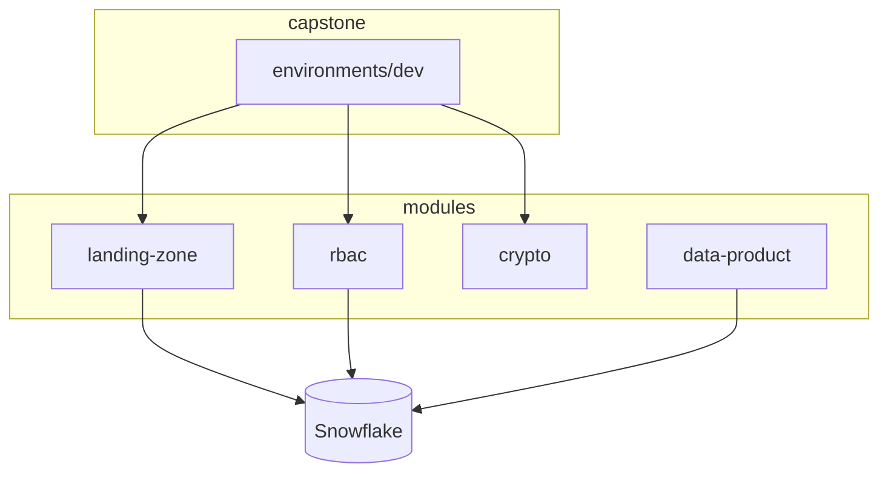

# Code Terraform — Fil rouge formation

Progression des dossiers :

| Dossier | Jour | Contenu |
|---------|------|---------|
| `admin-fix` | J0 formateur | Bootstrap/réparation de l'utilisateur `TERRAFORM_SVC` |
| `00-bootstrap` | Pré-requis | Azure Resource Group + Storage Account pour state |
| `01-day1-basics` | J1 M1,M4 | DB, WH, schemas, variables & lifecycle |
| `02-day1-state` | J2 M2 | Migration backend distant Azure |
| `03-day2-modules` | J3 M5-M6 | Modules landing-zone + dynamic logic |
| `04-day3-rbac` (RBAC) | J5 M11 | RBAC: Business (Analyst/Eng/Steward) & Technical roles, file formats, stages |
| `05-capstone` | J5 M12 | Déploiement complet (Key Vault, Azure stage, tags, monitors, network policy) |
| `06-data-products` | J5 M14 | Data Products SALES/FINANCE, Medallion et SQL Snow CLI |
| `07-devops-agents` | J0 formateur | Azure DevOps agent pool + Linux VM self-hosted runner |
| `08-learner-vms` | J0 formateur | VMs Windows par apprenant (RDP, outils pré-installés, first-logon auto) |

## Quick start

Avant tout, commencez par le [Jour 0 — Préparer votre environnement](../courses/day-00/README.md). Le parcours vérifie les outils, protège les secrets et configure une connexion Sandbox ou Trial sans déployer d’infrastructure.

```powershell
cd 01-day1-basics
copy terraform.tfvars.example terraform.tfvars
# Vérifier les valeurs de snowflake_organization, snowflake_account, snowflake_user, snowflake_password
terraform init
terraform plan
```

> **Auth :** en formation, le secret `SNOWFLAKE_PASSWORD` est fourni hors Git. En production, utilisez JWT key-pair avec une identité technique dédiée et Azure Key Vault.

## Architecture



Le module `data-product` publie la structure stable. Les fichiers SQL de `06-data-products/sql/` sont ensuite publiés avec Snow CLI.
